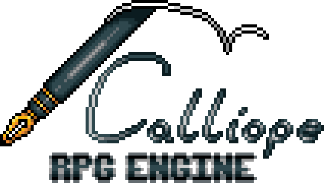

# Calliope RPG Engine

**Calliope RPG Engine** is a free and open-source RPG game engine built using MonoGame. It was developed over the course of ten weeks as a college capstone project.

## Overview

The engine is composed of two main components:

- **Runtime**  
  The application responsible for interpreting engine files and running them as a playable game.

- **Editor**  
  A tool used to create and manage the engine files that define a game.

## Features

- Free and open source
- Built with MonoGame
- Custom-built runtime and editor
- Original sample art and sound assets
- Designed and completed within a 200 hour, 10-week development cycle

---

# Controls

## Runtime:

| Key | Action |
|-----|--------|
| `Z` | Accept / Confirm |
| `X` | Cancel |
| `Tab` / `C` | Open Menu |
| `Esc` | Force Quit |
| `Shift` | Run |
| `WASD` / Arrow Keys | Move / Navigate Menu |
| `F1` | Maximize Window |

## Editor:

| Key / Input | Action |
|-------------|--------|
| Middle Mouse Button / `G` | Pan |
| `F` | Focus |
| Left Click | Place / Select |
| Right Click | Remove |
| `Esc` | Quit |
| `Space` | Recenter |
| `Enter` | Accept |
| Scroll Up / `I` | Zoom In |
| Scroll Down / `K` | Zoom Out |
| `Ctrl + Left Click` | Paint Placement |
| `+` / `-` | Increase / Decrease UI Scale |

---

## Notes

This project was developed as a capstone and demonstrates rapid development, custom tooling, and full-stack game engine design—including both runtime and content creation workflows.